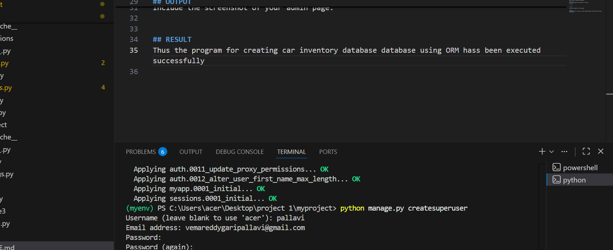

# Ex01 Django ORM Web Application
## Date: 24/11/25

## AIM
To develop a Django application to store and retrieve data from a Car Inventory Database using Object Relational Mapping(ORM).

## ENTITY RELATIONSHIP DIAGRAM


## DESIGN STEPS

### STEP 1:
Clone the problem from GitHub

### STEP 2:
Create a new app in Django project

### STEP 3:
Enter the code for admin.py and models.py

### STEP 4:
Execute Django admin and create details for 10 books

## PROGRAM
Model.py
```
from django.db import models
from django.contrib import admin
class Car(models.Model):
    reg_no=models.CharField(max_length=20,help_text="Car ID")
    name=models.CharField(max_length=100)
    price=models.IntegerField()
    year=models.IntegerField()
class CarAdmin(admin.ModelAdmin):
    list_display=('reg_no','name','price','year')

```
admin.py
```
from django.contrib import admin
from .models import Car,CarAdmin
admin.site.register(Car,CarAdmin)

```


## OUTPUT




## RESULT
Thus the program for creating car inventory database database using ORM hass been executed successfully
